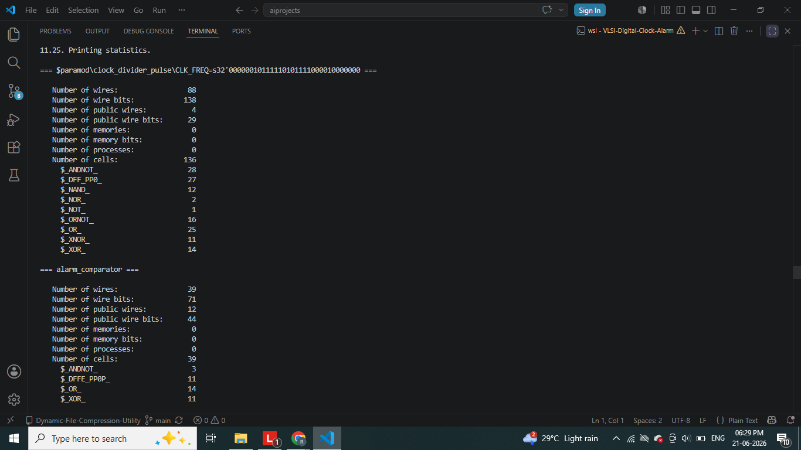
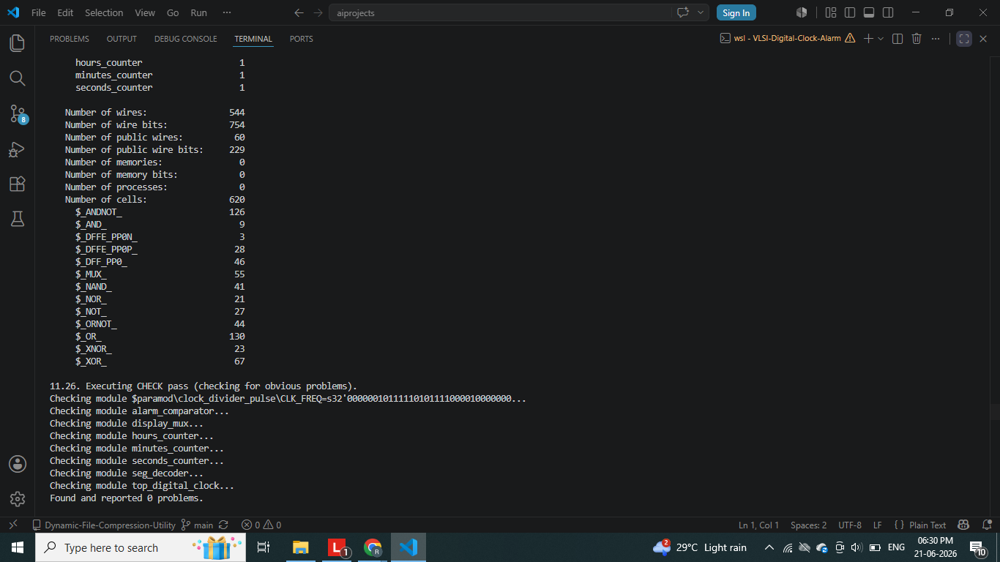
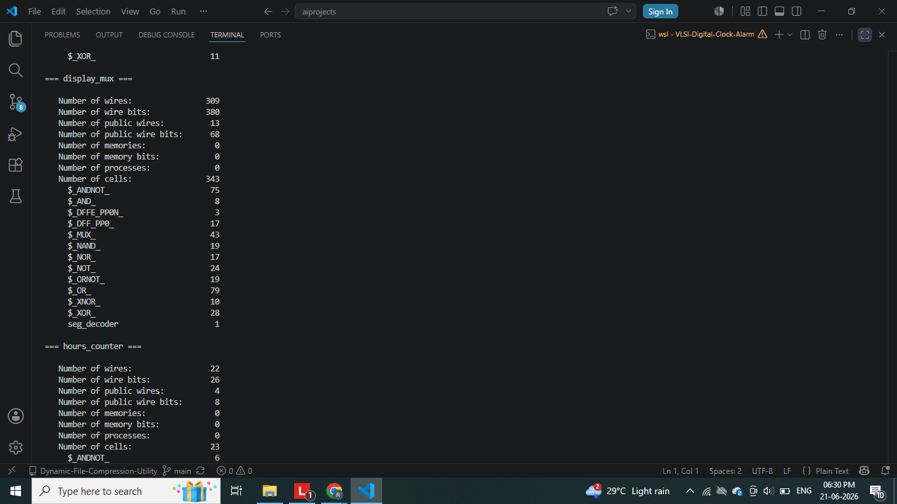
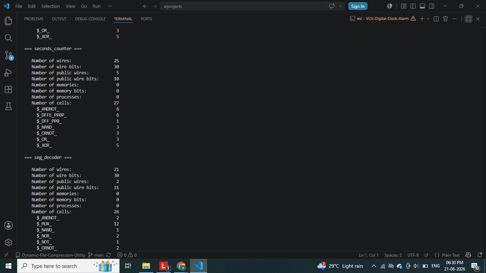
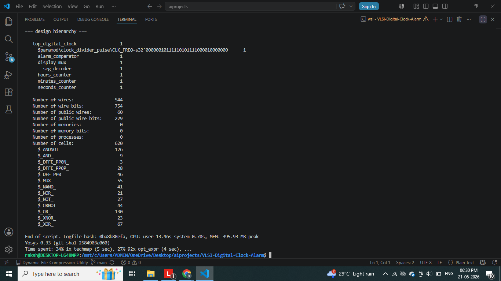

# VLSI-Based Digital Clock with Alarm Functionality

A complete Verilog/SystemVerilog implementation of a 24-hour digital clock
with configurable alarm functionality, seven-segment display output, and
full simulation + FPGA synthesis verification.

## Overview
This project implements a digital clock system using modular RTL design.
It tracks hours, minutes, and seconds via cascaded modulo counters, allows
a user-programmable alarm time, and drives a multiplexed seven-segment
display. The design is verified through simulation and is synthesis-ready
for Xilinx FPGA targets.

## Problem Statement
Build a synthesizable digital timekeeping circuit that:
- Maintains accurate HH:MM:SS time in 24-hour format
- Allows setting and enabling an alarm
- Triggers an output signal when current time matches alarm time
- Displays time on a seven-segment display

## VLSI Concepts Used
- Clock division and frequency synthesis
- Synchronous sequential counters (mod-60, mod-24)
- Carry-chain cascading between counter stages
- Combinational comparator design
- BCD to seven-segment decoding
- Time-division multiplexing for display
- Synchronous reset architecture
- Testbench-driven functional verification

## Clock Architecture
Clock Input → Clock Divider → Seconds Counter → Minutes Counter

→ Hours Counter → Alarm Comparator → Alarm Output

→ Seven-Segment Display

## Alarm Logic
The alarm register stores a user-set hour and minute. A combinational
comparator continuously checks current time against the alarm register;
when `alarm_enable` is high and hour/minute/second-zero all match, the
`alarm_out` signal pulses high.

## Tools Used
- Verilog / SystemVerilog
- Xilinx Vivado (synthesis, implementation, simulation)
- EDA Playground / ModelSim (alternative simulation)

## Folder Structure
VLSI-Digital-Clock-Alarm/
├── rtl/
├── tb/
├── constraints/
├── simulation/
├── waveforms/
├── reports/
├── images/
├── docs/
├── README.md
└── .gitignore

## How to Simulate
1. Clone this repository
2. Open ModelSim/Vivado/EDA Playground
3. Add all files from `rtl/` as design sources
4. Add `tb/tb_top_digital_clock.v` as the simulation source
5. Run simulation and inspect the waveform

## Sample Waveform
See `waveforms/` for captured simulation results showing:
- Seconds/minutes/hours rollover behavior
- Alarm match pulse generation

## Synthesis Report screenshots
|sim_log1|sim_log2|sim_log3|sim_log4|
|--------|--------|--------|--------|
|||||
|||||
|||||

## Waveforms Screenshots
|waveform|waveform|
|--------|--------|
|
- UART interface for PC-based time sync

## Learning Outcomes
- Hands-on experience with modular RTL design and hierarchy
- Practical understanding of clock domain management
- Testbench-driven verification methodology
- FPGA synthesis and constraint-file authoring

## Author
Rakshitha A S — B.E. Cybersecurity
